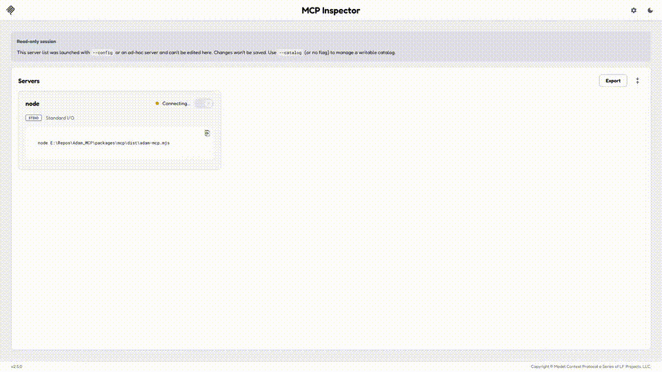

# ADAM MCP

[](https://github.com/Arudchayan/adam-mcp/actions/workflows/ci.yml)

ADAM MCP connects MCP-compatible AI clients to your University of Basel ADAM courses.

It runs on your machine. Cursor, Claude Desktop, VS Code Copilot, Windsurf, and Claude Code can list courses, read pages, find files, and surface deadlines from ADAM.

This is a community project, not a University of Basel service.



[YC marketing demo (~90s, chat UX)](docs/demo/adam-mcp-demo-yc.mp4) · [Legacy Inspector cut](docs/demo/adam-mcp-demo.mp4)

## What you can ask

- What changed in my courses this week?
- What deadlines do I have?
- Find the exercise sheet about Fourier transforms.
- Summarize this course page and give me the ADAM link.
- List the material available for this course.

Answers include canonical ADAM URLs (`https://adam.unibas.ch/go/...`).

## Quick start

You need Node.js 20+ and Google Chrome.

### Clone (supported path today)

```bash
git clone https://github.com/Arudchayan/adam-mcp.git
cd adam-mcp
npm install
npm run setup
```

`npm run setup` prints MCP snippets with **absolute paths** for this computer. Paste one into your client (Cursor, Claude Desktop, VS Code Copilot, Windsurf, or Claude Code).

- **Try it now** (synthetic catalog, no ADAM login): use the fixture snippet.
- **Your real courses:** `npm run login`, sign in to ADAM in Chrome, and use the `--browser` snippet. The window closes automatically; the session continues headless.

Restart the client, then ask:

> What courses am I in? Include the ADAM URL for each.

Host-specific files: [docs/setup.md](docs/setup.md).

### Registry install (not yet)

npm publish of `adam-mcp@0.1.0` is **paused**. Do not use `npx adam-mcp` / `npm install -g adam-mcp` as if they work today — clone + `npm run setup` is the working path. When publish resumes, the pack is self-contained (`dist/adam-mcp.mjs` plus runtime deps).

## How it works

```
AI client  --stdio MCP-->  adam-mcp  -->  Chrome session  -->  adam.unibas.ch
```

ADAM MCP uses a local Chrome session for ADAM authentication. Default without `--browser` is a fixture catalog so a clone does not hit production ADAM.

[Architecture](docs/architecture.md) · [What is in scope](docs/scope.md) · [Capabilities](docs/capabilities.md) · [Roadmap](docs/ROADMAP.md)

## Tools

| Tool | Returns |
| --- | --- |
| `adam_list_courses` | Enrolled courses and ADAM URLs |
| `adam_get_course` / `adam_list_children` | Course snapshot and folder contents |
| `adam_read_page` | Page text (`confirm: true`) |
| `adam_list_files` / `adam_get_file` | File metadata and URLs, not bytes |
| `adam_extract_file_text` | Local PDF/text extract (`confirm: true`) |
| `adam_search` | Title matches in enrolled objects |
| `adam_list_calendar` / `adam_list_news` | Dates and news from pages you can see |
| `adam_get_exercise` | Exercise text and deadline; no submit |
| `adam_login` / `adam_session_status` | Chrome session (`--browser` only; fixture hides them) |

Listings carry `listingState: ok | empty | unknown` — `empty` means the folder listed and has nothing (not a failure, not "no deadlines"); `unknown` means the list did not load, do not call it empty.

Prompts: `what_changed`, `prepare_my_week`, `study_this`.

## Limitations

- No writes, mail, grades, or exam (`tst`) objects.
- Search is not ADAM’s global search box. Dates are not the ILIAS calendar GUI.
- ChatGPT cannot attach a local stdio server.
- Scanned PDFs are not OCR’d.

## Privacy

Tool results go to the model your client is already using. Course content is copyrighted.

[SECURITY.md](SECURITY.md) · [threat model](docs/threat-model.md)

## Develop

```bash
npm test
npm run typecheck
```

[CONTRIBUTING.md](CONTRIBUTING.md) · [AGENTS.md](AGENTS.md)

License: GPL-3.0-or-later.
